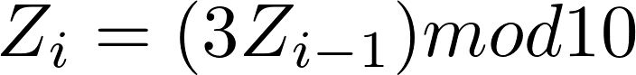

# Practice Final Exam Spring 2018

## Problem 1, Short Answer:
When I have two similar systems I want to compare, but I have different numbers of replications, what method should I use? 
Welches Method.

## Problem 2, Fill in the Blanks:
Consider with the results recorded in a table such as the one below:

| A Replication (i)| B Queueing time in one server| C Queueing time in two server| D Difference (B-C) |
| :-----------: |:-------------:| :----:| :----: |
| 1      | XX1 | YY1 | ZZ1 |
| 2      | XX2     |   YY2 | ZZ2 |
| ... | ...      |   ... | ...|
| 10 | XX10 | YY10 | ZZ10|

For scenario 1 we use stochastic sources of information. The streams are not synchronized and there is no corrolation. Answer the following questions:

Are observations in B column (e.g., XX1 and XX2) correlated?
NO

Are the observations in C column (e.g., YY1 and YY2) correlated?
NO

Are the observations in D column independent?
YES

Are observations between B and C columns (e.g., XX1 and YY1) correlated? 
NO

Var(B-C) = 
VAR(B)+Var(C) because -2*COV(B,C) is zero because B and C are independent. 

For scenario 2 we use the same randomized streams between B and C. 

Are observations in B column (e.g., XX1 and XX2) correlated?
NO

Are the observations in C column (e.g., YY1 and YY2) correlated?
NO

Are the observations in D column independent?
YES

Are observations between B and C columns (e.g., XX1 and YY1) correlated? 
YES

Var(B-C) = 
VAR(B)+Var(C)-2*COV(B,C) because -2*COV(B,C) is positively correlated. 

Does CRN Reduce CI in B column compared when we don't use CRN?
NO

Does CRN Reduce CI in C column compared when we don't use CRN?
NO

Does CRN Reduce CI in D column compared when we don't use CRN?
YES

## Problem 3, Distribution Function, Math Problem:

Given the following collected data, make a cumulative distribution function based on it:
{1, 3, 4, 3, 2}.

Answer:
1. Order the set: {1, 2, 3, 3, 4}
2. The number of different options is the number of steps: 4. 
3. Put each step on the y axis: {0.25, 0.50, 0.75, 1.00}
4. Plot: 

Provide a theoretical distribution of the data:

CONT ( 0, 1, 0.25, 2, 0.50, 3, 0.75, 3, 1.00, 4) 

Remember: The continuous distribution in SIE 531 is a set of (y, x) pairs, in order. 

Given this data and the linear congruential generator below, fill in the following table

| i | Z_i | U_i | Service Time |
|:-:|:---:| :-: | :-: |
| 0 |  5  | N/A | N/A |
| 1 |  4  | 0.4 | 2.6 |
| 2 |  1  | 0.1 | 1.4 |
| 3 |  2  | 0.2 | 1.8 |

## Problem 4 Goodness of Fit (Chi-square test), Math Problem:
Suppose we performed data collection on the time that customers spend at a 
McDonerds order line. The following data is in the chart below:

{0.1, 0.2, 0.7, 1.1, 1.2, 1.3, 1.4, 1.5, 1.6, 2.1, 2.2, 2.3, 2.4, 2.5, 3.1, 3.2} 

Use the Chi-Squared test to see how well it fits the theoretical distribution
TRIA(0, 2, 4). Assume that K=4 and alpha is 0.05. Note that the X^2_{3, 0.05} 
is 7.81, N=16. 

Where N _j is the actual distribution and E _j is the theoretical distribution. 

| j | 1 | 2 | 3 | 4 | 
|:-:|:-:|:-:|:-:|:-:|
|Nj | 3 | 6 | 5 | 2 |
|Ej | 2 | 6 | 6 | 2 |
|X^2| 0.5 | 0.0 | 0.166 | 0.0 | 

X^2 = 0.5 + 0.0 + 0.166 + 0 = 0.666 

Since 
0.666 &lt; 7.81 

Failure to reject H0, so it is a good fit.

## Problem 5 Simulation Process, Fill in the Blanks:

Fill in the blanks:

1. Timing Routine
2. Event Routine
3. Timing Routine
4. Update TNOW
5. Send Event Info

## Problem 6 Output Data Analysis, Short Answer: 
When do you want to use the Batch Means Method over the Truncated Method?

You would want to use the Batch Means Method over the Truncated Method when the
warm up time of a simulation is too long to efficiently do replications. 

## Problem 7 Non-stationary Process, Short Answer:
How can you achieve time-varying arrival rates?

You can use the thinning method, which has the generator produce an output at 
full rate, and when there are times when the output shall be smaller some of 
the output will be discarded as needed. 

